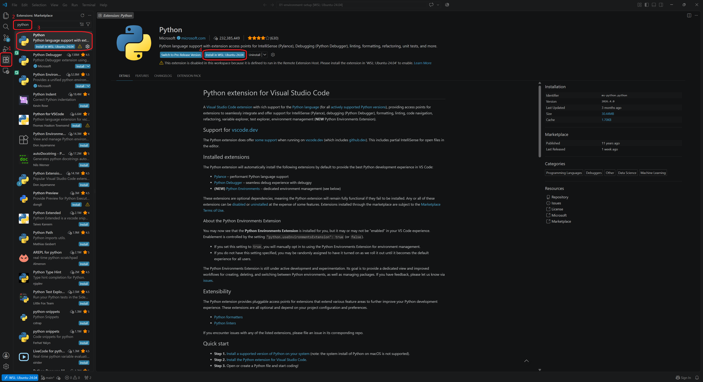
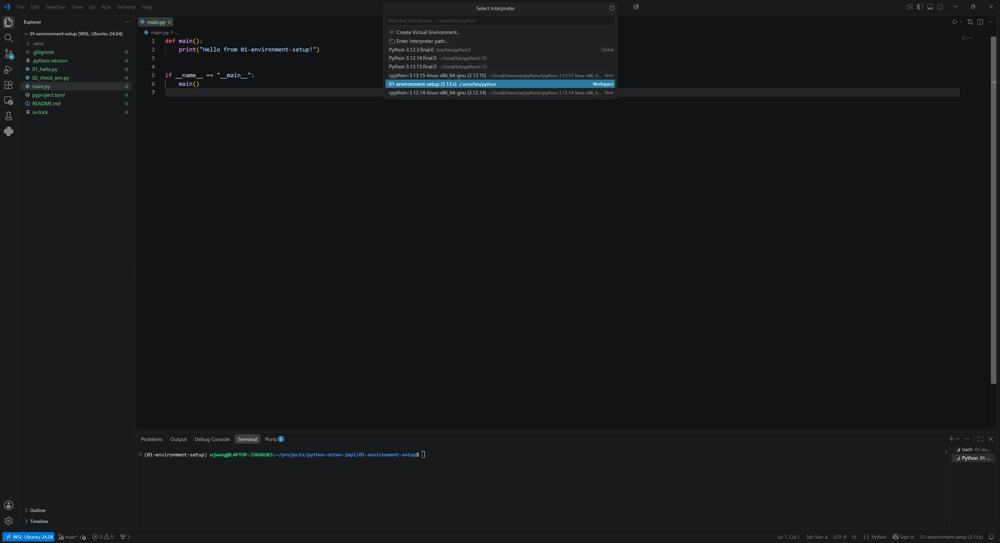
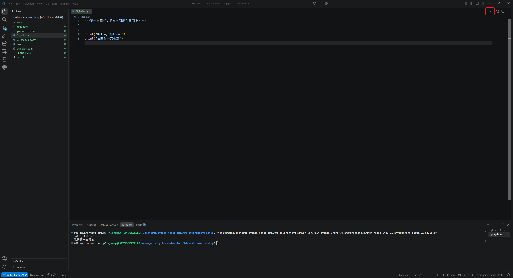
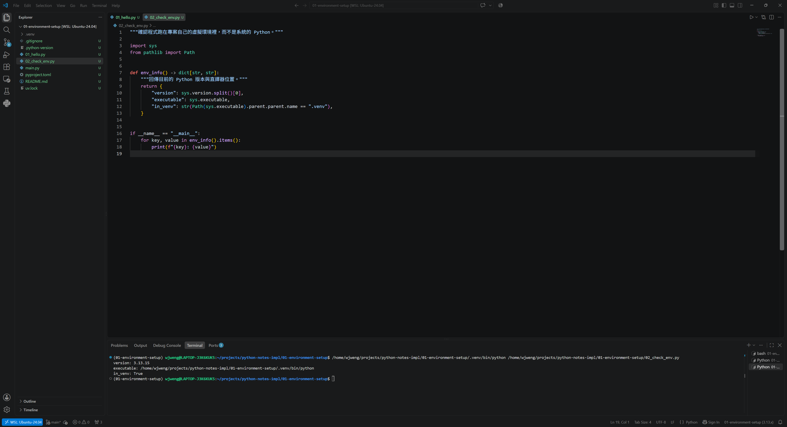

為了記錄自己學習 Python 的歷程，同時也給自己一些不要偷懶的壓力，我會將我學習到的內容，整理成一篇篇循序漸進的文章，從完全的新手開始，由淺入深開始學習。文章的選題與走向會有一些個人的偏好，很大程度也會跟不同時期我正在學習的領域有關，但大原則是該有的基本語法不會少，後面的章節會基於前面的章節來展開，如果有一些知識的斷層，那就再插入一個新的章節來補充。

話不多說，我們就開始吧！

# 把開發環境準備好

首先，要先把編寫 Python 的環境準備好，我會使用 uv 這個 Python 套件與專案管理器，以及 VS Code 做為 Python 程式的編輯器。

> **想直接進入程式的部分的話，也可以跳過這一章。**
<!-- only:github,web -->
> 我替每一章都製作了 [Colab 版](https://colab.research.google.com/github/wjweng/python-notes/blob/main/notebooks/01-environment-setup.ipynb)，用 Google 帳號登入就能改程式碼、按執行看結果，或複製一份到你的雲端硬碟中，這樣你所修改的東西就能保留在自己的儲存空間中，什麼都不用裝。
<!-- /only -->
<!-- only:github,colab -->
> 這些內容也做了一份[網頁互動版](https://wjweng.github.io/python-notes/)，不用登入，開啟網頁就可以觀看與執行。
<!-- /only -->
> 等你想在自己電腦上跑程式時，再回來看這章。

## 這一章會用到的工具

| 工具 | 做什麼 |
| :--- | :--- |
| uv | 管理 Python 版本、虛擬環境、套件 |
| VS Code | 寫程式的編輯器 |

另一個常見的做法是先到官網裝 Python，並使用 venv 建立虛擬環境，再用 pip 安裝需要的套件，現在 uv 把這三件事包在一起。我在後面也做了一個這兩種方法的對照表，有興趣的讀者可以參考。

關於 uv 的詳細說明可以參考[官網](https://docs.astral.sh/uv/)，以下僅就安裝所需要的指令來做說明。

## 安裝 uv

Windows 開啟 PowerShell，執行：

```powershell
powershell -ExecutionPolicy ByPass -c "irm https://astral.sh/uv/install.ps1 | iex"
```

macOS 或 Linux 開啟終端機，執行：

```bash
curl -LsSf https://astral.sh/uv/install.sh | sh
```

裝完之後**關掉終端機再重開一次**，否則系統可能找不到這個新指令。重開後詢問版本：

```bash
uv --version
```

有印出版本號就成功了。

## 用 uv 安裝 Python

```bash
uv python install 3.13
```

這行會下載 Python 3.13 並交由 uv 管理。它不會動到系統原本的 Python，也不需要設定環境變數。

裝完確認一下，看看到底裝進去了沒、裝的是哪一版：

```bash
uv python list --only-installed
```

會看到類似這樣的輸出（路徑依作業系統而不同）：

```
cpython-3.13.15-...    ~/.local/bin/python3.13 -> ~/.local/share/uv/python/...
cpython-3.12.3-...     /usr/bin/python3.12
```

第一行的路徑是剛才裝的 Python 3.13，第二行是我的系統原本就有的 Python，uv 沒有動到它，兩者並存。

`--only-installed` 這個旗標是為了讓這行指令只列出已經安裝的 Python 版本；不加的話，uv 會把「可以下載但還沒裝」的版本也一起列出來（後方會標有 `<download available>`）。

## 建立第一個專案

接著我們就可以來建立第一個專案啦！找一個放程式的資料夾，執行：

```bash
uv init --no-package 01-environment-setup
cd 01-environment-setup
```

uv 會建立一個資料夾，裡面長這樣：

```
01-environment-setup/
├── main.py           # 程式進入點
├── pyproject.toml    # 專案設定與套件清單
├── README.md
├── .python-version   # 這個專案要用哪個 Python 版本
├── .gitignore        # 哪些檔案不要進版本控制
└── .git/             # uv 順手幫你開好的版本控制庫
```

後面三個是隱藏檔，**`uv init` 會順手執行 `git init`**，自動建立起版本控制的 `.git/` `.gitignore`。現在可以完全不用管它，不影響 Python 的學習。

`pyproject.toml` 記錄這個專案需要哪些套件。有了它，換一台電腦只要一行指令就能把環境還原回來，不用憑記憶回想當初裝過什麼。

### --no-package 是什麼？

不加這個旗標的話，`uv init` 建出來的是另一種版型：

```
01-environment-setup/
└── src/
    └── 01_environment_setup/
        └── __init__.py
```

程式碼被收進 `src/` 底下，`pyproject.toml` 也會多出打包用的設定，這是**要把程式發布成套件給別人安裝**時的做法，同樣的現階段我們也可以先不用管它，用不到打包，所以加 `--no-package` 拿掉那層結構。

執行看看：

```bash
uv run main.py
```

第一次執行時 uv 會自動建立虛擬環境，執行過後，畫面上會看到以下這行文字：

```
Hello from 01-environment-setup!
```

恭喜你已經從頭到尾跑過一次環境建置與程式的執行，至此環境就已經通了，接下來我們要學習的就是改變 `main.py` 的內容，來達到我們想要控制程式輸出的結果。

## 虛擬環境是什麼

我們前面一直提到虛擬環境，它究竟是什麼呢？uv 又幫我們做了什麼事？

假設同時有兩個專案，A 專案需要某套件的 1.0 版，B 專案需要 2.0 版。如果所有套件都裝在同一個地方，這兩個專案就會打架。虛擬環境的做法是**讓每個專案有自己獨立的套件資料夾**，互不干擾。

uv 會把虛擬環境放在專案底下的 `.venv/`。假設我們要裝一個 `requests` 套件：

```bash
uv add requests
```

這行指令會做三件事：裝好 requests、寫進 `pyproject.toml`、更新鎖定檔 `uv.lock`。之後在別台電腦上只要執行 `uv sync`，就會裝回一模一樣的版本。

## uv 與傳統做法的指令對照

在進入下一個主題之前，我們來比較一下前面有提到的 pip 加 venv 的環境建置方式。對照表如下：

| 要做的事 | uv | 傳統做法 |
| :--- | :--- | :--- |
| 安裝 Python | `uv python install 3.13` | 到官網下載安裝檔 |
| 建立專案 | `uv init --no-package 專案名` | 自己開資料夾 |
| 建立虛擬環境 | 不用，執行時自動建 | `python -m venv .venv` |
| 啟動虛擬環境 | 不用 | `source .venv/bin/activate` |
| 安裝套件 | `uv add requests` | `pip install requests` |
| 記錄用了哪些套件 | 自動寫進 `pyproject.toml` | `pip freeze > requirements.txt` |
| 在別台電腦還原 | `uv sync` | `pip install -r requirements.txt` |
| 執行程式 | `uv run main.py` | `python main.py`（需先啟動虛擬環境）|

### 兩種做法的優缺點

看完對照表，我們也順便來看一下兩種做法各自的優缺點，未來遇到需要選擇的場合，會比較知道怎麼判斷。

uv 的好處主要在這幾個地方：

- **一個工具管完三件事**：Python 版本、虛擬環境、套件都由 uv 處理，不需要在官網下載、`venv`、`pip` 之間切換。
- **速度快上不少**：uv 是用 Rust 寫的，我在自己的電腦上實測安裝 pandas（不使用快取），pip 花了約 10 秒，uv 只要約 2.4 秒，套件愈多的專案差距會愈明顯。
- **不用手動啟動虛擬環境**：`uv run` 會自動使用專案底下的 `.venv`，忘記啟動這件事就不會發生。
- **環境可以完整重現**：`uv.lock` 記下每個套件的確切版本，換一台電腦執行 `uv sync` 就能裝回一模一樣的環境，比 `pip freeze` 產生的 `requirements.txt` 嚴謹一些。

至於要付出的代價，也有幾個：

- **網路上的教學大多還是 pip 的寫法**：搜尋問題時看到的指令跟這裡不一樣是正常的，需要自己對照轉換。
- **它比較新**：遇到比較少見的問題時，可以參考的討論會比 pip 少一些。
- **底層觀念還是要懂**：uv 把 venv 與 pip 的步驟包起來了，但虛擬環境是什麼、套件裝到哪裡去，這些概念在排查問題時還是用得上。

兩種做法在這個階段都能完成這一系列的所有練習，如果你覺得舊有的方法看起來比較熟悉也沒關係，在這個階段不會有任何影響，把左右兩欄所做的事情對應起來就好。

## 編輯器：VS Code

為了可以在一個更方便、美觀的介面來編輯與執行 Python 程式，這系列的文章會使用 VS Code，到 [code.visualstudio.com](https://code.visualstudio.com/) 下載安裝。開啟後先裝一個擴充套件就夠了：左側點擴充功能圖示，搜尋 **Python**，安裝 Microsoft 發行的版本。



裝好後用 VS Code 開啟剛才的 `01-environment-setup` 資料夾。右下角會顯示目前使用的直譯器，確認它指向專案底下的 `.venv`。如果沒有，按 `Ctrl + Shift + P`（macOS 是 `Cmd + Shift + P`），輸入 `Python: Select Interpreter`，選擇 `.venv` 那一個。



如此一來，編輯器才會用這個環境的 Python 去檢查程式碼，而不是套用系統預設的設定，否則在這個環境中裝好的套件就會找不到，如果要執行的程式依賴這些套件的話就會產生錯誤。

## 第一支程式

要建立一份新的 Python 格式檔案可以在最上排工作列點選 `File` -> `New File`，或是在左側的檔案總管欄位按右鍵新增 `New File`，把這個檔案取名叫 `01_hello.py`，在裡面打上：

```python
print("Hello, Python!")
print("我的第一支程式")
```

執行：

```bash
uv run 01_hello.py
```

結果如下：

```
Hello, Python!
我的第一支程式
```

也可以按 VS Code 右上方的三角形按鈕來執行 Python 程式。要注意的是，這個按鈕用的是剛才選定的直譯器，而不是 `uv run`，所以直譯器選對了，這個按鈕才會跑在專案自己的虛擬環境裡。




`print()` 是把東西顯示在畫面上的函數，括號裡放要顯示的內容。文字要用引號包起來，單引號或雙引號都可以，但同一個專案裡建議固定用一種。

## 確認環境真的裝對了

寫一支小程式來驗證，新增檔案 `02_check_env.py`：

```python
import sys
from pathlib import Path


def env_info() -> dict[str, str]:
    """回傳目前的 Python 版本與直譯器位置。"""
    return {
        "version": sys.version.split()[0],
        "executable": sys.executable,
        "in_venv": str(Path(sys.executable).parent.parent.name == ".venv"),
    }


if __name__ == "__main__":
    for key, value in env_info().items():
        print(f"{key}: {value}")
```

執行結果如下：

```
version: 3.13.15
executable: /path/to/01-environment-setup/.venv/bin/python
in_venv: True
```



<!-- only:web -->
> 在這個網頁上按執行，結果會跟上面的圖示不一樣，原因是網頁版的 Python 是一份編譯成 WebAssembly，跑在瀏覽器分頁裡的 Python，它的環境大概跟你剛才建立的虛擬環境不同，想要看到 `in_venv: True`，還是要回到自己的電腦上執行。
<!-- /only -->

`in_venv` 是 `True`，代表程式跑在專案自己的虛擬環境裡，不是系統的 Python。這行如果是 `False`，就要回頭檢查上面 VS Code 選直譯器那一步。

## 互動模式

除了寫成檔案執行，也可以直接在終端機裡試語法：

```bash
uv run python
```

會進入互動模式，提示符號是 `>>>`：

```
>>> 1 + 1
2
>>> print("測試")
測試
>>> exit()
```

想確認某個語法怎麼運作，又不想特地開一個檔案時，這樣測試最快。輸入 `exit()` 可以離開互動模式。

---

## 常見問題統整

### 找不到 .venv 的排查步驟

選單裡沒有 `.venv` 是很常見的狀況，依序確認：

**一、`.venv` 真的存在嗎？** 它是**第一次跑 `uv run` 才建立**的，`uv init` 不會產生。前面那步如果跳過了，回到終端機執行一次：

```bash
uv run main.py
```

執行後資料夾裡才會多出 `.venv`。

**二、VS Code 開的是 `01-environment-setup` 這一層嗎？** 擴充套件只會掃工作區的根目錄，開到上一層資料夾就會找不到。

**三、跑指令的地方和 VS Code 是同一個系統嗎？** 這是在 Windows 系統下使用 WSL 的使用者最容易卡住的地方：在 WSL 的 Ubuntu 終端機裡跑 uv，卻用 Windows 版的 VS Code 開檔案，`.venv/bin/python` 是 Linux 執行檔，Windows 端會找不到它。

解法是讓 VS Code 連進 WSL，在 WSL 終端機裡的專案資料夾底下執行：

```bash
code .
```

第一次會自動把 VS Code Server 裝進 WSL，然後開一個新視窗，**左下角出現 `WSL: Ubuntu`** 就表示連上了。如果還是沒有連上，可以點選左下角的 `Open a Remote Window` 圖示，選擇 `Connect to WSL`，應該就可以連上。

在 Windows 端裝的 Python 擴充套件，連進 WSL 之後也必須重新安裝一次，裝完再選一次直譯器，`.venv/bin/python` 就會出現。

如果不想要這麼麻煩，那就全部留在 Windows，用 PowerShell 跑 uv 吧！把專案放在 `C:\` 底下。兩條路都可以，**但不要混用**。走 WSL 的話，專案建議放在 WSL 自己的家目錄，放在 `/mnt/c/` 底下操作檔案會明顯變慢。

---

這一章我們準備好了 Python 的開發環境，也從頭建置了第一支 Python 的小程式，了解每一支應用程式的順利執行與否，其實是和它相依的環境息息相關的；我們也比較了 uv 和 pip + venv 的環境建置方式，可以選擇習慣或是喜歡的方法來開始。萬事俱備，之後的所有變化就會在這個程式的語法裡面進行。

## 本章程式碼

- [`code/`](./code/) — 本章所有可執行範例
<!-- only:github,web -->
- [在 Colab 開啟](https://colab.research.google.com/github/wjweng/python-notes/blob/main/notebooks/01-environment-setup.ipynb) — 用 Google 帳號登入就能執行，可以複製一份留在自己的雲端硬碟
<!-- /only -->
<!-- only:github,colab -->
- [在瀏覽器直接執行](https://wjweng.github.io/python-notes/web/01-environment-setup.html) — 不用登入，開啟就能改程式碼看結果
<!-- /only -->
